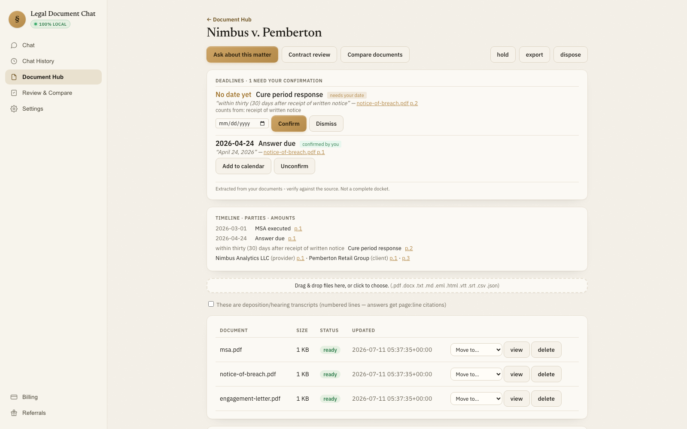

# Legal Document Chat for Attorneys: Private, Self-Hosted, Cited

**Run every matter privately, on your own hardware: drag documents into a matter, get answers cited to the exact page and mechanically verified, and see attorney-confirmed deadlines flow straight to your calendar.**

🌐 **Website and desktop app: [docuchat.app](https://docuchat.app).** One-click download for macOS (Windows soon), or run it from source below.

[](LICENSE)
[](https://www.python.org/)
[](#tech-stack)
[](CONTRIBUTING.md)
[](https://docuchat.app)

<a href="https://www.producthunt.com/posts/legal-document-chat-for-attorneys-open?utm_source=badge-featured&amp;utm_medium=badge" target="_blank"></a>



> _A matter overview: deadlines waiting on your confirmation, one already confirmed and ready to add to your calendar, every row cited to the source page. Shown with synthetic documents. Development uses synthetic/public data only._

## Why this exists

Attorneys need to parse, search, and ask questions across **privileged, confidential documents**, but sending those documents to a closed-model cloud API (OpenAI, Anthropic, Gemini) puts that privilege at risk. In *United States v. Heppner* (S.D.N.Y. 2026), a court found that a defendant's chats with a consumer cloud AI tool were not protected by attorney-client privilege, in part because the vendor's own privacy policy permitted using that data for other purposes. That is a vendor-policy problem: a tool that never sends your documents to a vendor in the first place removes the vendor from the privilege analysis entirely.

This project is a **self-hosted, privacy-first** document-intelligence stack that runs **100% locally**:

- **Your documents never leave your machine.** Inference, embeddings, OCR, and storage are all local. The query path makes **no cloud calls** and binds to **loopback only** (`127.0.0.1`).
- **Open-source / local models** via [Ollama](https://ollama.com). No API keys, no per-token billing, no vendor lock-in.
- **Every answer is grounded and verified.** A mechanical, character-level check confirms each cited quote actually appears in the cited source. Unverifiable claims are dropped, never shown. If the documents don't support an answer, it says so instead of hallucinating. The same mechanical check gates every fact the matter digest extracts, so nothing lands on a deadlines panel or timeline without a verified source span.

This local-first design does not mean privilege can never be waived, or that using an AI tool automatically preserves it: privilege law also turns on attorney conduct. It means the specific failure mode *Heppner* turned on, a vendor's privacy policy sitting in the data path, cannot occur here, because there is no vendor in the data path.

It is a **cited-retrieval assistant, not an AI lawyer and not an autonomous agent.** It locates and summarizes what documents say, with citations the user verifies. It gives no legal advice and has no tools to act on the outside world.

## Who this is for

- **Solo and small-firm attorneys** who want their matters, documents, and deadlines in one private place, with nothing sent to a cloud vendor.
- **Engineers building legal tech** who need a private, inspectable RAG stack instead of a black-box SaaS.
- **Solo founders & AI agencies** who want a self-hostable "chat with documents" product they can deploy for privacy-sensitive clients.

Practicing attorneys: open an issue describing a real workflow (see [CONTRIBUTING](CONTRIBUTING.md)).

## How it compares to cloud AI chat

How local, self-hosted legal document chat differs from sending documents to a cloud chatbot (ChatGPT, Claude, Gemini):

| | **Legal Document Chat** (this project) | Cloud AI chat (ChatGPT / Claude / Gemini) |
|---|---|---|
| Where your documents go | Stay on your machine, loopback only (`127.0.0.1`) | Uploaded to a third-party cloud |
| Models | Local, open-source via [Ollama](https://ollama.com) | Closed, vendor-hosted |
| Citations | Mechanically verified to page + exact span | Often unverified or hallucinated |
| Works offline / air-gapped | Yes (after a one-time model download) | No |
| Cost | Free, no API keys, no per-token billing | Subscription or per-token |
| Vendor in the privilege analysis | None: no vendor ever receives your documents | A vendor, and its privacy policy, sits in the data path |

## Features

- **Matters as the unit of work.** Every document, conversation, and extracted fact lives inside a matter. The Document Hub is a filing cabinet: new documents land in Unfiled with their source, and you drag them onto the matter they belong to. Retrieval is hard-filtered to the open matter, so one client's documents can never leak into another's answer.
- **Matter digest: an instant overview, not a summary.** Opening a matter shows parties, a timeline, and deadlines, extracted at ingest and mechanically verified against the source before they're ever stored. docuchat never computes a deadline date itself: it shows the source language and an "Add to calendar" action only after you confirm the date.
- **Mechanically verified citations.** Every cited span is checked character-by-character against the retrieved source chunk. A fabricated or altered quote yields zero citations. This is the core differentiator, and it's the same check that gates the matter digest.
- **Page- and span-level citations.** Answers point to file, page, and the exact highlighted text; click to open the source at that spot.
- **Deposition and hearing transcripts** with `page:line` citations, so an answer sourced from a transcript points to the exact line, not just the page.
- **28 connectors, user-keyed.** Pull documents in from notetakers, transcription services, work management, CRM, and file storage tools using your own account and API key. Imports land in Unfiled with provenance, exactly like a manual upload, then you drag them onto a matter.
- **One-click, signed updates.** The desktop app checks for and installs new releases in place; every release is signed and notarized before it ships.
- **Document Hub** with drag-and-drop upload, async parse/ingest, and a status view.
- **Table & exhibit extraction.** Fee schedules and damages tables are extracted as structured, searchable, citable content (Docling TableFormer), not garbled text.
- **OCR for scanned PDFs.** Image-only pages are routed through local Tesseract; born-digital pages keep the fast path.
- **Contract Review clause checklist.** Run a curated clause set over a contract; each clause comes back cited or flagged "potentially missing."
- **Multi-document review grid.** Rows = documents, columns = questions, cells = cited answers, for reviewing many documents at once.
- **Honest refusal.** Answers "I could not find this in the documents" rather than inventing one.
- **Air-gapped by design.** Loopback-only, no telemetry, no cloud dependencies at query time.

## Tech stack

| Layer | Choice |
|---|---|
| Backend / API | **Python · FastAPI** (loopback-only) |
| Local inference | **Ollama**, `qwen3:14b` (chat + digest extraction), `bge-m3` (embeddings), `bge-reranker-v2-m3` (optional) |
| Vector store | **LanceDB** (embedded, no server) |
| Parsing & OCR | **PyMuPDF**, **Docling** (TableFormer), **Tesseract**, **python-docx** |
| Retrieval & answering | **Hand-rolled RAG**, no LangChain, no LlamaIndex, for a transparent claim → chunk → character-offset citation path |
| UI | Vanilla **HTML / CSS / JS** (no framework) |
| Deploy | **Docker Compose** (publishes `127.0.0.1:8000` only) |

## Download

The easiest way to run docuchat is the **one-click desktop app** at **[docuchat.app](https://docuchat.app)**: no terminal, and a first-run wizard installs the local models for you. macOS is available today; a Windows build is coming soon. Prefer to run it yourself? Follow the Quickstart below.

## Quickstart

**Prerequisites:** [Ollama](https://ollama.com) running locally, Python 3.12+, and (optional) Tesseract for scanned PDFs / Docker Desktop for the container path.

```bash
# 1. Pull the local models (one-time download; runs offline afterward)
ollama pull qwen3:14b
ollama pull bge-m3

# 2a. Run locally (Python), run from inside pipeline/
cd pipeline
python -m venv .venv && source .venv/bin/activate
pip install -r requirements.txt
python api.py
#    → open http://127.0.0.1:8000/app
```

```bash
# 2b. ...or run with Docker Compose (loopback-only)
deploy/up.sh
#    → open http://127.0.0.1:8000/app
#    deploy/down.sh to tear down
```

Then open the **Document Hub**, create a matter, upload a PDF (use your own or any public/synthetic document), and start asking questions. Every answer comes back with a clickable, verified citation, and once the matter has documents its digest builds automatically in the background.

> **Optional, scanned PDFs:** install Tesseract (`brew install tesseract` on macOS) before ingesting image-only documents.

## Architecture

```
ingest → parse → chunk + embed → retrieve → answer → verify → cite
                         ↓
              digest: extract facts → verify spans → matter overview
```

1. **Ingest / parse.** PyMuPDF for born-digital text (with page + character offsets), Docling TableFormer for tables, Tesseract for scanned pages.
2. **Chunk + embed.** Page/section-aware chunks with source context, embedded by `bge-m3` into LanceDB.
3. **Retrieve.** A hard **matter pre-filter** runs *before* similarity search (so retrieval is scoped to one matter), with an optional local reranker.
4. **Answer.** `qwen3:14b` answers from the retrieved context under a strict grounded-and-cite-or-refuse prompt.
5. **Verify.** Each cited quote is mechanically checked to overlap a retrieved chunk's character range on its page. The displayed page/span is **derived from the verified match**, never asserted by the model.
6. **Cite.** The UI shows the answer with source chips and opens the original page with the cited span highlighted.
7. **Digest.** At ingest, a background pass proposes parties, dates, amounts, and other facts per document; the same span verifier that gates chat citations gates every fact. A failed span is dropped, not stored. Deadline dates are never computed by docuchat: the attorney confirms them.

## Evaluation

Every release is measured against a golden set before it ships: **63/63 expected answers present, 9/9 not-found cases correctly refused, and 0 fabricated citations** on the answer path. The matter digest's extraction has its own gate, measured against a hand-labeled fact inventory, and stores zero unverified spans: a proposed fact that fails the mechanical span check is dropped and counted, never surfaced.

## Roadmap

- **Shipped:** matters (Document Hub, drag-to-matter) · mechanical span verification · matter digest (parties, timeline, attorney-confirmed deadlines with add-to-calendar) · deposition/hearing transcripts with `page:line` citations · 28 user-keyed connectors · one-click signed updates · table/exhibit extraction · OCR for scans · Contract Review clause checklist · multi-document review grid.
- **Planned:** OAuth connectors for vendors that require it (Clio, Google, Microsoft), a Windows build, DocuSign / e-signature import, a client-file retention schedule, and a cross-matter "due this week" view.
- **Privacy posture:** development uses **synthetic / public documents only**; this is a deliberate boundary, not a limitation of the code.

See [`DECISIONS.md`](DECISIONS.md) for the full architecture-decision record (why hand-rolled RAG, why LanceDB over a server, why mechanical citation verification, etc.).

## FAQ

**Is this a private, local legal document chat?**
Yes. It's a self-hosted "chat with your legal documents" tool that runs entirely on your own hardware. Inference, embeddings, OCR, and storage are all local, and the service binds to loopback (`127.0.0.1`) only.

**Does my data leave my computer?**
No. The query path makes no cloud calls and requires no API keys. Your documents are never uploaded to OpenAI, Anthropic, Google, or any third party.

**Does using an AI tool waive attorney-client privilege?**
It can, depending on the vendor and how the tool is used; see *United States v. Heppner* (S.D.N.Y. 2026), where a court found no privilege in a defendant's chats with a consumer cloud AI tool because the vendor's privacy policy permitted using that data for other purposes. docuchat removes that specific failure mode by construction: there is no vendor in the data path, because your documents never leave your machine. This is not a guarantee that privilege can never be waived; other conduct still matters.

**Does it work offline / air-gapped?**
Yes. After a one-time local model download via [Ollama](https://ollama.com), it runs with no internet connection.

**Can I chat with scanned PDFs, or deposition transcripts?**
Yes. Image-only pages are routed through local Tesseract OCR, while born-digital pages keep the fast text path. Transcripts get `page:line` citations. Tables are extracted as structured, citable content.

**What is the matter digest, and can I trust the deadlines it shows?**
The digest is an instant overview built at ingest time: parties, a timeline, and deadlines, with every row cited to a verified source span. docuchat never calculates a deadline date; you confirm the date before it can be added to your calendar. The panel says so directly: extracted from your documents, verify against the source, not a complete docket.

**How is this different from using ChatGPT, Claude, or Gemini on legal documents?**
Those send your documents to a third-party cloud, putting a vendor's privacy policy in the privilege analysis. This keeps everything local, uses open-source models, and mechanically verifies every citation to a real page and span. See [How it compares](#how-it-compares-to-cloud-ai-chat).

**Is this an AI lawyer? Does it give legal advice?**
No. It is a cited-retrieval assistant: it locates and summarizes what your documents say, with citations you verify. It gives no legal advice, draws no legal conclusions, and takes no actions.

**What models and stack does it use?**
Local open-source models via Ollama (`qwen3:14b` for chat and digest extraction, `bge-m3` for embeddings), with FastAPI, LanceDB for vector search, and PyMuPDF / Docling / Tesseract for parsing and OCR. See [Tech stack](#tech-stack).

## Contributing

Contributions are very welcome, see **[CONTRIBUTING.md](CONTRIBUTING.md)**. We're especially looking for help with new document parsers, additional local model backends, evaluation harnesses, and UI. Domain experts (practicing attorneys) are welcome to open issues describing real workflows.

## License

[MIT](LICENSE).

- Note: this project depends on **PyMuPDF**, which is **AGPL-3.0** licensed. That's fine for an open-source, self-hosted deployment; be aware of its copyleft terms if you build a closed derivative.
- The clause taxonomy is informed by the **CUAD** dataset (CC-BY-4.0).
